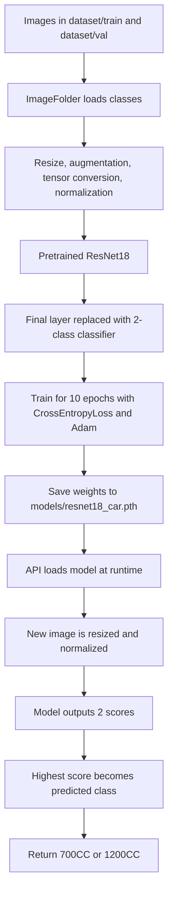

# ResNet18 Car Classifier Explanation

This document explains how the car classifier in this project is trained, how ResNet18 works, and how the trained model is used to predict the car class from an image.

## 1. What this project does

The project is a 2-class image classifier. It takes an image of a car and predicts one of these categories:

- `700CC`
- `1200CC`

The model is trained on your image dataset and then used in the API to predict a class for a new image.

## 2. Main files involved

- Training script: [ml/train.py](ml/train.py)
- Model loader: [app/model.py](app/model.py)
- Inference function: [app/predict.py](app/predict.py)
- API endpoint: [app/main.py](app/main.py)

## 3. Dataset structure

The training code uses `torchvision.datasets.ImageFolder`, which expects a directory structure like this:

```text
dataset/
  train/
    1200cc/
    700cc/
  val/
    1200cc/
    700cc/
```

Each subfolder name is treated as a class label. All images inside `dataset/train/1200cc` are assigned to one class, and all images inside `dataset/train/700cc` are assigned to the other class.

## 4. How training works

The training logic is in [ml/train.py](ml/train.py).

### 4.1 Device selection

The script first checks whether a GPU is available:

```python
device = torch.device("cuda" if torch.cuda.is_available() else "cpu")
```

If a GPU exists, training runs on it. Otherwise, it uses the CPU.

### 4.2 Image preprocessing during training

Before images go into the model, they are transformed into a format the network can learn from:

```python
transform = transforms.Compose([
    transforms.Resize((224, 224)),
    transforms.RandomHorizontalFlip(),
    transforms.RandomRotation(15),
    transforms.ToTensor(),
    transforms.Normalize([0.485, 0.456, 0.406],
                         [0.229, 0.224, 0.225])
])
```

What each step does:

- `Resize((224, 224))`: forces every image to the same input size.
- `RandomHorizontalFlip()`: randomly flips some images left-right to improve generalization.
- `RandomRotation(15)`: slightly rotates images so the model can handle angle changes.
- `ToTensor()`: converts the image into a PyTorch tensor with values in the range 0 to 1.
- `Normalize(...)`: scales the tensor using ImageNet mean and standard deviation, which matches the preprocessing used by the pretrained ResNet18 weights.

### 4.3 Loading the dataset

The script loads the images with `ImageFolder`:

```python
train_data = datasets.ImageFolder("dataset/train", transform=transform)
val_data = datasets.ImageFolder("dataset/val", transform=transform)
```

This means:

- The folder names become class labels.
- The transforms are applied automatically when an image is loaded.

The data is then wrapped in `DataLoader` objects:

```python
train_loader = DataLoader(train_data, batch_size=8, shuffle=True)
val_loader = DataLoader(val_data, batch_size=8)
```

Important detail: the current script creates a validation loader, but it does not actually run a validation loop. So the model is trained for 10 epochs, but validation metrics are not computed in the current code.

### 4.4 Building the ResNet18 model

The model starts from a pretrained ResNet18:

```python
model = models.resnet18(weights=ResNet18_Weights.DEFAULT)
```

This means the network begins with weights learned from ImageNet, not random weights. That is useful because the model already knows general visual features like edges, textures, shapes, and patterns.

Then the last layer is replaced:

```python
model.fc = nn.Linear(model.fc.in_features, 2)
```

This changes the final classifier from ImageNet’s 1000 classes to your 2 classes.

### 4.5 Loss function and optimizer

The training uses:

```python
criterion = nn.CrossEntropyLoss()
optimizer = torch.optim.Adam(model.parameters(), lr=0.0001)
```

Meaning:

- `CrossEntropyLoss` compares the model’s predicted scores against the correct class label.
- `Adam` updates the weights efficiently.
- The learning rate `0.0001` is small, which is common for fine-tuning pretrained networks.

### 4.6 Training loop

The model is trained for 10 epochs:

```python
for epoch in range(10):
    model.train()
    total_loss = 0

    for images, labels in train_loader:
        images, labels = images.to(device), labels.to(device)

        optimizer.zero_grad()
        outputs = model(images)
        loss = criterion(outputs, labels)

        loss.backward()
        optimizer.step()

        total_loss += loss.item()
```

Step by step:

1. `model.train()` puts the model in training mode.
2. A batch of images and labels is loaded.
3. The images and labels are moved to the selected device.
4. `optimizer.zero_grad()` clears the old gradients.
5. The model predicts class scores for the batch.
6. `CrossEntropyLoss` measures how wrong the predictions are.
7. `loss.backward()` computes gradients.
8. `optimizer.step()` updates the model weights.
9. The loss is accumulated for logging.

### 4.7 Saving the trained weights

After training, the model weights are saved here:

```python
models/resnet18_car.pth
```

The code creates the `models/` folder if it does not exist and then saves only the learned parameters with `torch.save(model.state_dict(), output_path)`.

## 5. How ResNet18 works

ResNet18 is a convolutional neural network designed for image recognition.

### 5.1 Basic idea

Deep networks often become harder to train as they get deeper because gradients can vanish or the model can stop improving effectively. ResNet solves this by using **residual connections**.

Instead of learning only a direct mapping from input to output, each block learns a small correction, or residual, and adds the original input back in.

Mathematically, a residual block learns:

$$
H(x) = F(x) + x
$$

Where:

- `x` is the input to the block
- `F(x)` is the transformation learned by the block
- `H(x)` is the final output after adding the shortcut connection

### 5.2 Why residual connections help

Residual connections make it easier for the network to:

- keep useful information from earlier layers,
- train deeper models more reliably,
- reduce degradation when adding more layers.

### 5.3 Typical ResNet18 flow

ResNet18 usually has:

- an initial convolution and pooling stage,
- several residual blocks,
- global average pooling,
- a final fully connected classifier.

In this project, the final classifier is replaced so the network outputs 2 scores instead of 1000.

## 6. Why pretrained ResNet18 is a good choice

Using pretrained ResNet18 gives several advantages:

- Faster training than starting from scratch.
- Better accuracy with smaller datasets.
- Strong feature extraction from the beginning.
- Less risk of overfitting compared to a large custom model.

Because your dataset is a focused 2-class problem, transfer learning is a sensible approach.

## 7. How prediction works

The inference logic is in [app/predict.py](app/predict.py).

### 7.1 Loading the trained model

The model is loaded through [app/model.py](app/model.py):

```python
model = models.resnet18(weights=None)
model.fc = nn.Linear(model.fc.in_features, 2)
model.load_state_dict(torch.load(MODEL_PATH, map_location=device))
model.to(device)
model.eval()
```

Important difference from training:

- Training starts from pretrained ImageNet weights.
- Inference rebuilds the same architecture and loads your saved fine-tuned weights.

That works because the architecture is the same and the saved file contains the trained parameters.

### 7.2 Input preprocessing during prediction

The prediction transform is:

```python
transform = transforms.Compose([
    transforms.Resize((224, 224)),
    transforms.ToTensor(),
    transforms.Normalize([0.485, 0.456, 0.406],
                         [0.229, 0.224, 0.225])
])
```

This is almost the same as training, except the random flip and rotation are removed. That is correct for inference because the image should be evaluated consistently.

### 7.3 Running the forward pass

The input image is converted to a batch of size 1:

```python
image = transform(image).unsqueeze(0).to(device)
```

Then prediction runs without gradient tracking:

```python
with torch.no_grad():
    outputs = model(image)
    _, predicted = torch.max(outputs, 1)
```

What happens here:

- `torch.no_grad()` disables training behavior and saves memory.
- `model(image)` produces 2 output scores.
- `torch.max(outputs, 1)` returns the class index with the highest score.

### 7.4 Converting the index to a label

The predicted index is mapped to a class name:

```python
classes = ["700CC", "1200CC"]
return classes[predicted.item()]
```

This final step turns the numeric prediction into a human-readable label.

## 8. How the API uses the model

The API endpoint is in [app/main.py](app/main.py).

It accepts raw image bytes in a POST request to `/predict`:

1. The request body is read.
2. The bytes are opened with PIL as an RGB image.
3. The image is sent to `predict_image`.
4. The predicted class is returned as JSON.

Example response:

```json
{
  "car_type": "700CC"
}
```

## 9. End-to-end flow



## 10. Important implementation notes

- The validation loader is created but not used in the current training script.
- The training transform includes random augmentation, which is good for training but not ideal for validation.
- The predicted class order must match the label encoding used during training.
- If the folder names or label order change, the `classes` list in [app/predict.py](app/predict.py) must also be updated.

## 11. Simple explanation in plain words

In simple terms, the model learns by looking at many labeled car images and adjusting itself so it can tell the difference between the two classes. ResNet18 helps by reusing features learned from a very large dataset, so your model does not have to learn everything from zero. When a new car image arrives, the same resizing and normalization steps are applied, the trained ResNet18 produces a score for each class, and the class with the higher score is returned as the prediction.

## 12. Summary

This project uses transfer learning with ResNet18 to classify car images into 2 categories. The model is trained on your image folders, saved as a `.pth` file, loaded by the API, and used to predict the car class for a new image.